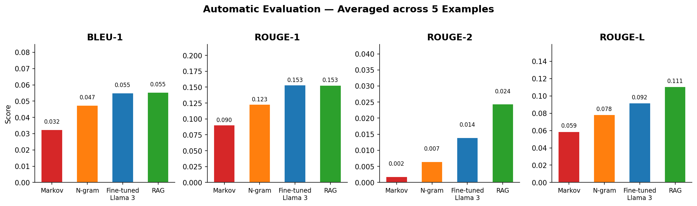
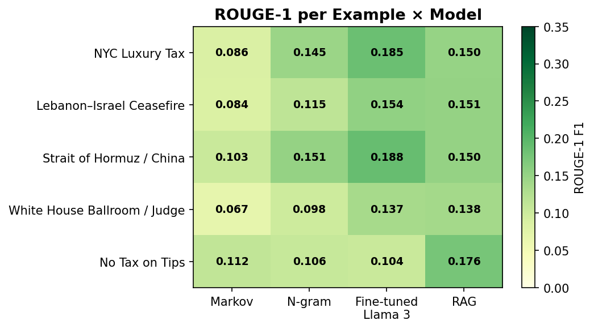
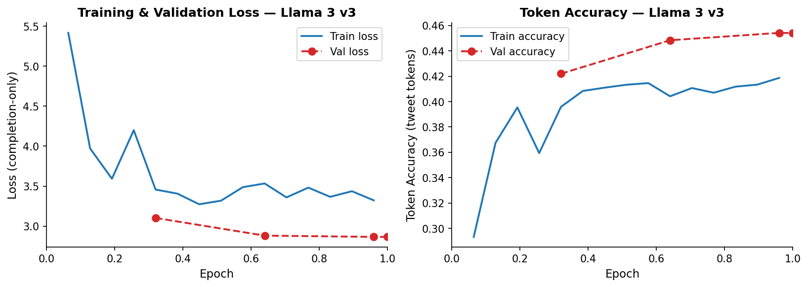
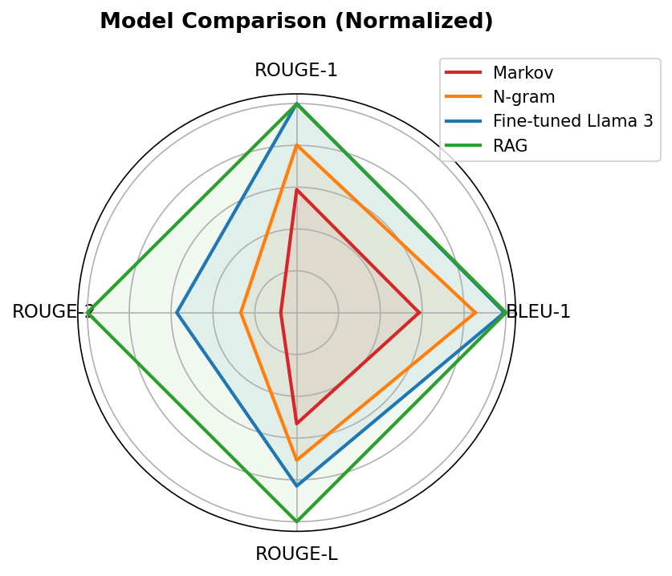

# News-Conditioned Presidential Post Generation

### A Comparative Study of Markov, N-gram, LoRA Fine-Tuning, and Retrieval-Augmented Generation

[](https://python.org)
[](https://pytorch.org)
[](LICENSE)
[](#paper)

Given a set of news headlines, predict what Donald Trump would post on social media. We frame this as a **news-conditioned text generation** task and benchmark four approaches — from classical n-gram models to LoRA fine-tuned Llama 3 8B — on a corpus of 86,170 verified posts spanning Twitter (2009–2021) and Truth Social (2022–2026).

---

## Results

Evaluated on 5 diverse held-out examples (April 2026 posts), each scored against verified ground truth with BLEU and ROUGE averaged over 5 generated candidates:

| Model | BLEU-1 | BLEU-2 | ROUGE-1 | ROUGE-2 | ROUGE-L |
|---|---|---|---|---|---|
| Markov Chain | 0.032 | 0.004 | 0.090 | 0.008 | 0.069 |
| N-gram (trigram) | 0.047 | 0.008 | 0.123 | 0.012 | 0.086 |
| **LoRA Fine-tuned Llama 3 8B** | **0.055** | 0.008 | **0.154** | 0.009 | 0.095 |
| RAG (base Llama 3 8B) | 0.056 | **0.012** | 0.153 | **0.010** | **0.097** |

**Key finding:** Fine-tuned Llama and RAG tie on average but with complementary strengths — fine-tuning generalizes better to novel named entities; RAG excels when retrieved examples closely match the input format. ROUGE-2 ≤ 0.012 across all models, indicating Trump's specific rhetorical constructions are not recoverable by surface metrics.

---

## Figures

<p align="center">
  
  <br><em>Automatic evaluation scores averaged across 5 examples and 4 metrics</em>
</p>

<p align="center">
  
  <br><em>Per-example ROUGE-1 F1 — fine-tuned Llama leads on 3/5 topics</em>
</p>

<p align="center">
  
  <br><em>Training and validation loss/accuracy over 1 epoch (782 steps, ~17h on Apple M5 MPS). Spikes at steps ~672 and ~725 are Mac sleep interruptions — both recovered.</em>
</p>

<p align="center">
  
  <br><em>Normalized model comparison across all 5 metrics</em>
</p>

---

## Dataset

| Source | Posts | Period |
|---|---|---|
| Twitter | 58,857 | 2009–2021 |
| Truth Social | 27,313 | 2022–2026 |
| **Total** | **86,170** | **2009–2026** |

After filtering (no retweets, no replies, 30–400 chars): **65,733 posts**

**News corpus:** ~1.3M articles — 1.27M from the NYT Archive API + 32K from The Guardian, stored in SQLite.

**Semantic matching:** Each post is matched to news headlines published in the 48h window before it using `all-MiniLM-L6-v2` cosine similarity (threshold ≥ 0.20). Average matched-pair similarity: **0.339** vs ~0.05 for random pairs.

| Split | Examples |
|---|---|
| Train | 59,159 |
| Validation | 6,574 |

> **Large files** (model weights, full news DB, training JSONLs) are hosted on HuggingFace — see [Assets](#assets) below.

The cleaned tweet corpus (`trump_tweets_cleaned.csv`, 21MB) is included in this repo.

---

## Models

### 1. Markov Chain (`markov_predictor.py`)
Second-order Markov chain trained on the full tweet corpus. 607,851 unique bigrams. Keyword-seeded generation from headline terms. No news awareness — pure tweet-corpus statistics.

### 2. N-gram Trigram (`ngram_predictor.py`)
Trigram language model with keyword-seeded generation. Same corpus. Serves as a slightly stronger statistical baseline.

### 3. LoRA Fine-tuned Llama 3 8B (`finetune_llama.py`)
- **Base model:** `meta-llama/Meta-Llama-3-8B-Instruct`
- **LoRA:** rank=16, alpha=32, applied to all attention + MLP projections (16M trainable of 8B total, 0.2%)
- **Training format:** `prompt`/`completion` dict with `completion_only_loss=True` — loss computed exclusively on tweet tokens (critical: prevents prompt leakage)
- **Hardware:** Apple M5 32GB, bfloat16, MPS backend
- **Duration:** ~17 hours, 782 optimizer steps
- **Val loss:** 2.866 | **Token accuracy:** 45.4% (tweet tokens only)

### 4. RAG Pipeline (`generate_rag.py`)
- FAISS `IndexFlatIP` over 58,229 dense embeddings (384-dim `all-MiniLM-L6-v2`)
- Top-5 retrieval → few-shot prompt → **base** Llama 3 8B Instruct generation
- No fine-tuning; stylistic signal comes entirely from retrieved (headline, tweet) examples

---

## Installation

```bash
git clone https://github.com/rishabh790453/trump-tweet-predictor
cd trump-tweet-predictor
python3 -m venv venv && source venv/bin/activate
pip install -r requirements.txt
```

Requires Python 3.11+. For Apple Silicon (MPS), bfloat16 is used automatically — do **not** use float16 (causes Metal segfaults).

---

## Usage

### Generate with fine-tuned Llama 3
```bash
# Download model from HuggingFace first (see Assets)
python generate_llama.py --headlines "Fed raises rates by 50bps" "Dow drops 800 points"
python generate_llama.py --date 2026-04-16   # uses news DB headlines for that date
python generate_llama.py --n 8 --temp 0.9   # 8 candidates, higher temperature
```

### Generate with RAG
```bash
python generate_rag.py --headlines "NYC mayor proposes luxury home tax"
```

### Run full evaluation
```bash
python evaluate_all.py
# Outputs: evaluation_results.json + figures/
```

### Train from scratch
```bash
# Requires HF token for Llama 3 access
export HF_TOKEN=your_token_here
python finetune_llama.py --model llama3 --max 25000 --epochs 1
# On Apple Silicon, ~50s/step. Use: nohup caffeinate -i & before closing lid
```

---

## Training Log

The full training log for the final v3 run (782 steps, ~17 hours) is at [`logs/finetune_v3.log`](logs/finetune_v3.log). Two sleep interruptions are visible as loss spikes at steps ~672 and ~725; both recovered within 10 steps.

Previous runs:
- `logs/finetune_v2.log` — failed run (assistant_only_loss incompatible with Llama 3 chat template)
- `logs/finetune_llama.log` / `finetune_llama_full.log` — earlier v1 experiments (prompt leakage issue)

---

## Assets

| Asset | Size | Location |
|---|---|---|
| Fine-tuned Llama 3 8B (merged) | 16 GB | HuggingFace: `rishabh790453/trump-llama-v3` *(coming soon)* |
| Training pairs (`finetune_train.jsonl`) | 50 MB | HuggingFace Datasets *(coming soon)* |
| RAG index (`rag_index.faiss`) | 85 MB | HuggingFace Datasets *(coming soon)* |
| RAG data (`rag_data.jsonl`) | 44 MB | HuggingFace Datasets *(coming soon)* |
| News SQLite DB (1.3M articles) | 1.6 GB | Not redistributable (NYT API TOS) |
| Tweet corpus (cleaned) | 21 MB | [`trump_tweets_cleaned.csv`](trump_tweets_cleaned.csv) ✓ |
| Validation set | 5.8 MB | [`finetune_val.jsonl`](finetune_val.jsonl) ✓ |

---

## Paper

**"News-Conditioned Presidential Post Generation: A Comparative Study of Markov, N-gram, LoRA Fine-Tuning, and Retrieval-Augmented Generation"**

Rishabh Gulecha — April 2026

LaTeX source: [`paper.tex`](paper.tex) | Compiled via Overleaf

---

## Repository Structure

```
trump-tweet-predictor/
├── finetune_llama.py        # LoRA fine-tuning (Llama 3 8B, MPS)
├── generate_llama.py        # Inference with fine-tuned model
├── generate_rag.py          # RAG pipeline inference
├── evaluate_all.py          # Full evaluation + figure generation
├── markov_predictor.py      # Markov chain baseline
├── ngram_predictor.py       # N-gram trigram baseline
├── trump_tweets_cleaned.csv # 86K cleaned posts
├── finetune_val.jsonl       # 6,574 validation pairs
├── evaluation_results.json  # Final scores (all 5 examples)
├── paper.tex                # LaTeX paper source
├── figures/                 # Generated evaluation figures (8 PNGs)
├── logs/                    # Training logs (finetune_v3.log is the main one)
├── predictions/             # Saved prediction JSONs from test runs
├── scripts/                 # Data pipeline, fetch scripts, utilities
├── config/                  # API config templates
└── docs/                    # Setup guides
```

---

## Known Issues / Lessons Learned

- **Prompt leakage (v1/v2):** Without `completion_only_loss=True`, the model learns to predict the system prompt verbatim. This is the most common SFT mistake. Fixed in v3.
- **TRL 1.0 API:** `DataCollatorForCompletionOnlyLM` was removed. `assistant_only_loss=True` requires `` in the chat template (Llama 3 doesn't have it). Use `prompt`/`completion` dict format instead.
- **bfloat16 on MPS:** float16 causes Metal segfaults. Always use bfloat16 on Apple Silicon.
- **Mac sleep during training:** Use `nohup caffeinate -i &` before starting long runs. PyTorch/MPS survives sleep and resumes correctly.

---

## License

MIT — see [LICENSE](LICENSE).

The tweet corpus is sourced from publicly available Trump social media posts. The NYT/Guardian news data is not included in this repo due to API terms of service.
